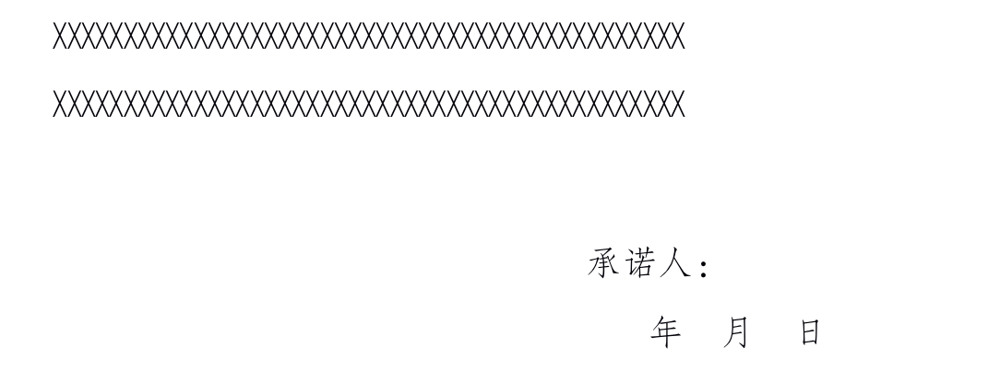
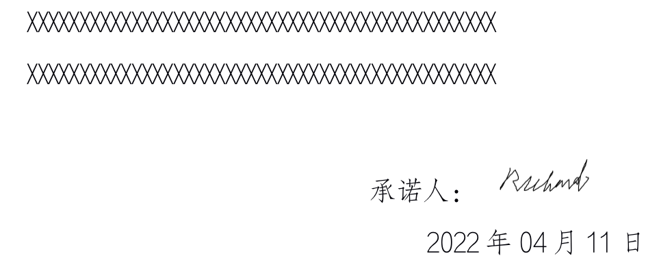
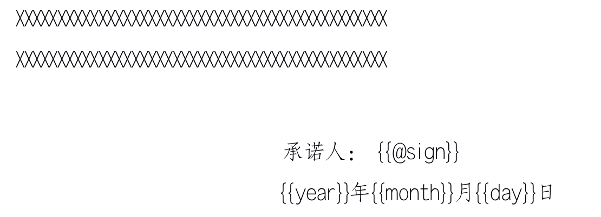

# 用poi-tl向已有word的指定位置中插入数据/图片

​		有一个需求就是word文档已存在，但是要在文档的末尾插入签名和日期。如下，图1变成图2。



变成



我这边是用了poi-tl，真的好方便，所以记录一下

### 1. 引入pom

```xml
<dependency>
  <groupId>com.deepoove</groupId>
  <artifactId>poi-tl</artifactId>
  <version>1.10.0</version>
</dependency>
```

### 2. 编辑文档

1. 插入文字用”**{{标签}}**“；

2. 插入图片用”**{{@标签}}**“

   如下图：我这边承诺人需要插入签字后的图片，年月日要根据当天日期动态填写。

   

**注：双括号中的标签是自己随便写的标识，这部分待会要和代码中相对应！**

### 3. 上代码

话不多说，直接附上代码：

```java
public void generateWord(String imageUrl) throws Exception {
        LocalDate date = LocalDate.now();
        // 读取目标文件路径
        XWPFTemplate template = XWPFTemplate.compile("/AAA/BBB/原文件.docx");
  			// 数据内容
        Map<String, Object> map = new HashMap<>();
        map.put("sign", Pictures.ofStream(new FileInputStream(imageUrl), PictureType.PNG).size(50, 25).create());
        map.put("year", date.getYear());
        map.put("month", date.getMonthValue() < 10 ? "0" + date.getMonthValue() : date.getMonthValue());
        map.put("day", date.getDayOfMonth() < 10 ? "0" + date.getDayOfMonth() : date.getDayOfMonth());
        template.render(map);
  			// 文件路径
        String filePath = "/AAA/BBB/新文件.docx";
  			// 写文件
        template.write(new FileOutputStream(filePath));
    }
```

输出的结果就是图二，我这边就不重复贴图啦~