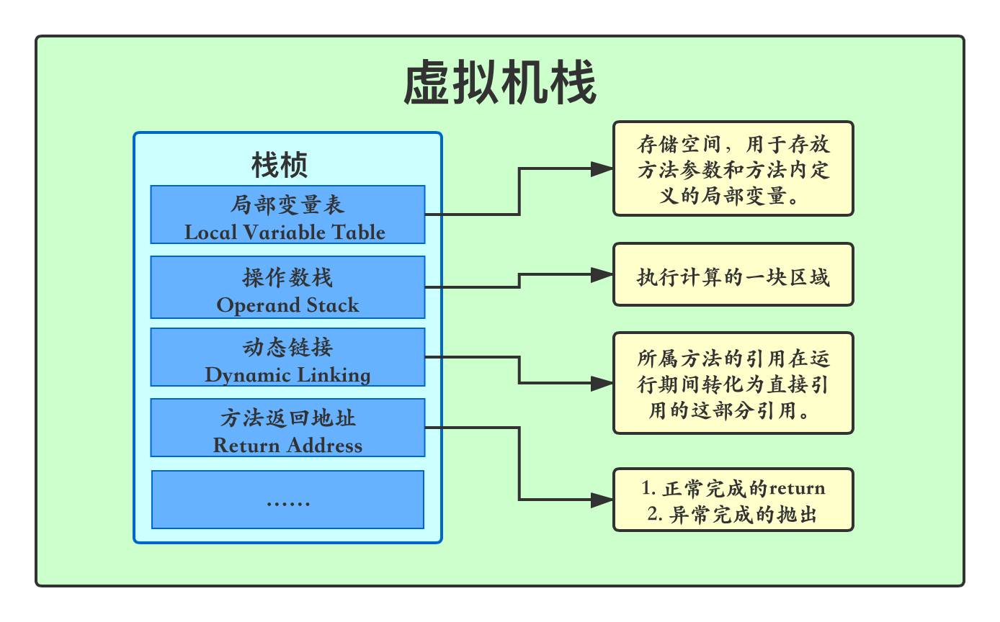

# JVM内存结构——运行时数据区

[TOC]

　　Java虚拟机在执行Java程序的过程中会把它管理的内存分为若干个不同的数据区域。这些区域有着各自的用途及创建和销毁的时间，有的区域随着虚拟机进程的启动而存在，有些区域则依赖用户线程的启动和结束而建立和销毁。根据《Java虚拟机规范》中规定，jvm所管理的内存大致包括以下几个运行时数据区域，如图所示： 

下面进行单独讲解这几块区域：

## 1. 程序计数器

　　占据一块较小的内存空间，线程私有，可以看做当前线程所执行的字节码的**行号指示器**。在虚拟机概念模型里，字节码解释器工作时就是通过改变这个计数器的值来选取下一条需要执行的字节码指令、分支、循环、跳转、异常处理、线程恢复等基础功能都需要依赖这个计数器来完成。

　　由于jvm的多线程是通过线程轮流切换并分配处理器执行时间的方式来实现的，在任何一个确定的时刻，一个处理器都只会执行一条线程中的指令。因此为了线程切换后能恢复到正确的执行位置，每条线程都需要有一个独立的程序计数器，各条线程之间计数器互不影响，独立存储，我们称这类内存区域为“线程私有”的内存。

　　如果线程正在执行的是一个Java方法，这个计数器记录的是正在执行的虚拟机字节码指令的地址；

　　如果正在执行的是Native方法，这个计数器则为空（undefined）。

**注：此内存区域是唯一一个在Java虚拟机规范中没有规定任何OutOfMemoryError（内存溢出）情况的区域。**

##  2. Java虚拟机栈

　　线程私有，生命周期和线程相同，虚拟机栈描述的是Java方法执行的内存模型，每个方法在执行的同时都会创建一个栈帧，用于存储局部变量表、操作数栈、动态链接、方法出口等信息。每一个方法从调用直至完成的过程，就对应着一个栈帧在虚拟机栈中入栈到出栈的过程。

　　这块内存区域就是我们常常说的“栈”，在Java虚拟机规范中，对此区域规定了两种异常状况：如果线程请求的栈深度大于虚拟机所允许的深度，将会抛出**StackOverflowError异常**；如果虚拟机栈可以动态扩展时无法申请到足够的内存，就会抛出**OutOfMemoryError异常**。

​	整个线程执行过程中，每个方法对应着虚拟机栈中的一个**栈帧**，方法调用对应着一个栈帧的入栈，方法执行结束对应着一个栈帧的出栈。每个方法在执行的同时会创建一个栈帧，用于存储局部变量表、操作数栈、动态链接、方法返回地址等信息。（如下图）

### 2.1 局部变量表

​	**局部变量表(Local Variable Table)**是一组变量值存储空间，用于存放方法参数和方法内定义的局部变量。局部变量表的容量以变量槽(Variable Slot)为最小单位，Java虚拟机规范并没有定义一个槽所应该占用内存空间的大小，但是规定了一个槽应该可以存放一个32位以内的数据类型。

> 在Java程序编译为Class文件时，就在方法的Code属性中的max_locals数据项中确定了该方法所需分配的局部变量表的最大容量。(最大Slot数量)

​	一个Slot可以保存一个类型为boolean、byte、char、short、int、float、reference和returnAddress类型的数据。reference类型表示对一个对象实例的引用。returnAddress类型是为jsr、jsr_w和ret指令服务的，目前已经很少使用了，由异常表代替。如果是64位数据类型的变量(如long或double型)，则会连续使用两个连续的Slot来存储。

​	在局部变量表的第0位索引的Slot默认存放当前方法所属对象实例的引用。也就是我们常用的this。

### 2.2 操作数栈

​	**操作数栈(Operand Stack)**也常称为操作栈，是栈帧中用来执行计算的一块区域。它是一个后入先出栈(LIFO)。同局部变量表一样，操作数栈的最大深度也在编译的时候写入到方法的Code属性的max_stacks数据项中。

​	操作数栈的每一个元素可以是任意Java数据类型，32位的数据类型占一个栈容量，64位的数据类型占2个栈容量，且在方法执行的任意时刻，操作数栈的深度都不会超过max_stacks中设置的最大值。

​	当一个方法刚刚开始执行时，其操作数栈是空的，随着方法执行和字节码指令的执行，会从局部变量表或对象实例的字段中复制常量或变量写入到操作数栈，再随着计算的进行将栈中元素出栈到局部变量表或者返回给方法调用者，也就是出栈/入栈操作。一个完整的方法执行期间往往包含多个这样出栈/入栈的过程。

### 2.3 动态连接

​	在一个class文件中，一个方法要调用其他方法，需要将这些方法的符号引用转化为其在内存地址中的直接引用，而符号引用存在于方法区中的运行时常量池。

​	这些符号引用一部分会在类加载阶段或者第一次使用时就直接转化为直接引用，这类转化称为**静态解析**。另一部分将在每次运行期间转化为直接引用，这类转化称为**动态连接(Dynamic Linking)**。

### 2.4 方法返回

​	一个方法执行结束后应该回到的位置地址。

​	当一个方法开始执行时，可能有两种方式退出该方法：

- **正常完成出口**
- **异常完成出口**

**正常完成出口**是指方法正常完成并退出，没有抛出任何异常(包括Java虚拟机异常以及执行时通过throw语句显示抛出的异常)。如果当前方法正常完成，则根据当前方法返回的字节码指令，这时有可能会有返回值传递给方法调用者(调用它的方法)，或者无返回值。具体是否有返回值以及返回值的数据类型将根据该方法返回的字节码指令确定。

**异常完成出口**是指方法执行过程中遇到异常，并且这个异常在方法体内部没有得到处理，导致方法退出。

​	无论方法采用何种方式退出，在方法退出后都需要返回到方法被调用的位置，程序才能继续执行，方法返回时可能需要在当前栈帧中保存一些信息，用来帮他恢复它的上层方法执行状态。

​	一般来说，方法正常退出时，调用者的PC计数值可以作为返回地址，栈帧中可能保存此计数值。而方法异常退出时，返回地址是通过异常处理器表确定的，栈帧中一般不会保存此部分信息。

## 3. 本地方法栈

　　本地方法栈与虚拟机栈所发挥的作用非常相似，他们之间的区别不过是虚拟机栈为虚拟机执行Java方法（字节码）服务，而本地方法栈则为虚拟机中使用到的native方法服务。在虚拟机规范中对本地方法栈中方法使用的语言、使用方式与数据结构并没有强制规定，因此具体的虚拟机可以自由实现它。甚至有的虚拟机直接把本地方法栈和虚拟机栈合二为一，与虚拟机栈一样也会抛出StackOverflowError异常和OutOfMemoryError异常。

## 4. Java堆

 　　对于大多数应用来说，堆空间是jvm内存中最大的一块。Java堆是被所有线程共享，虚拟机启动时创建，此内存区域唯一的目的就是存放对象实例，几乎所有的对象实例都在这里分配内存。这一点在Java虚拟机规范中的描述是：所有的对象实例以及数组都要在堆上分配，但是随着JIT编译器的发展和逃逸分析技术逐渐成熟，栈上分配，标量替换优化技术将会导致一些微妙的变化发生，所有的对象都分配在堆上也就变得不那么绝对了。

　　Java堆是垃圾收集器管理的主要区域，因此很多时候也被称为“GC堆”。从内存回收角度看，由于现在收集器基本都采用分代收集算法，所以Java堆还可以细分为：新生代和老年代；再细致一点的有Eden空间，From Survivor空间，To Survivor空间等。从内存分配的角度来看，线程共享的Java堆中可能划分出多个线程私有的分配缓冲区。不过无论如何划分，都与存放内容无关，无论哪个区域，存储的都仍然是对象实例，进一步划分的目的是为了更好的回收内存，或者更快的分配内存。（如果在堆中没有内存完成实例分配，并且堆也无法再扩展时，将会抛出OutOfMemoryError异常。）

 	在 Java 中，堆被划分成两个不同的区域：新生代 ( Young )、老年代 ( Old )。新生代 ( Young ) 又被划分为三个区域：Eden、From Survivor、To Survivor。
 	堆的内存模型大致为：

## 5. 方法区（也有人叫永久代）

 　　和堆一样所有线程共享，主要用于存储已被jvm加载的类信息、常量、静态变量、即时编译器编译后的代码等数据。

​	在JDK1.7以前HotSpot虚拟机使用永久代来实现方法区，永久代的大小在启动JVM时可以设置一个固定值（-XX:MaxPermSize），不可变；

​	在JDK1.7中 存储在永久代的部分数据就已经转移到Java Heap或者Native memory。如符号引用(Symbols)转移到了native memory，把原本存放在永久代的字符常量池移出。但永久代仍存在于JDK 1.7中，并没有完全移除。

​	JDK1.8中进行了较大改动：

> 移除了永久代（PermGen），替换为元空间（Metaspace）；
> 永久代中的 class metadata 转移到了 native memory（本地内存，而不是虚拟机）；
> 永久代中的 interned Strings 和 class static variables 转移到了 Java heap；
> 永久代参数 （PermSize MaxPermSize） -> 元空间参数（MetaspaceSize MaxMetaspaceSize）

## 常见问题：

### 1. 运行时数据区哪些是线程独享

​	我们可以根据Java虚拟机运行时数据区的图得出，只有方法区和堆是线程共享的，而虚拟机栈、本地方法栈、程序计数器都是线程独享的，也就是说，并发时这些数据都是安全的。

### 2. 堆和栈的区别

1. 作用：

   栈内存用来存储局部变量和方法调用。

   而堆内存用来存储Java中的对象。

2. 线程私有还是共享

   栈内存归属于单个线程，每个线程都会有一个栈内存，其存储的变量只能在其所属线程中可见，即栈内存可以理解成线程的私有内存。

   而堆内存中的对象对所有线程可见。堆内存中的对象可以被所有线程访问。是线程共享的。

3. 异常错误

   如果线程请求的栈深度大于虚拟机所允许的深度，将会抛出StackOverflowError异常；如果栈可以动态扩展时无法申请到足够的内存，就会抛出OutOfMemoryError异常。

   如果在堆中没有内存完成实例分配，并且堆也无法再扩展时，将会抛出OutOfMemoryError异常。

4. 空间大小

   栈的内存要远远小于堆内存。对于大多数应用来说，堆空间是jvm内存中最大的一块。

### 3. 方法区在不同版本JDK中的位置

​	在JDK1.7以前HotSpot虚拟机使用永久代来实现方法区，永久代的大小在启动JVM时可以设置一个固定值（-XX:MaxPermSize），不可变；

​	在JDK1.7中 存储在永久代的部分数据就已经转移到Java Heap或者Native memory。如符号引用(Symbols)转移到了native memory，把原本存放在永久代的字符常量池移出。但永久代仍存在于JDK 1.7中，并没有完全移除。

​	JDK1.8中进行了较大改动：

> 移除了永久代（PermGen），替换为元空间（Metaspace）；
> 永久代中的 class metadata 转移到了 native memory（本地内存，而不是虚拟机）；
> 永久代中的 interned Strings 和 class static variables 转移到了 Java heap；
> 永久代参数 （PermSize MaxPermSize） -> 元空间参数（MetaspaceSize MaxMetaspaceSize）

