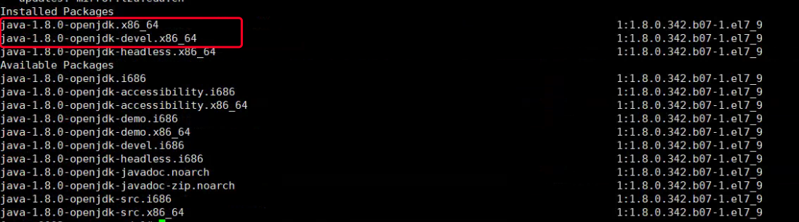
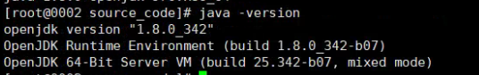

# linux安装集合

[TOC]

​	linux环境如果能够联网，安装相对而言还是比较方便的。虽然我还是踩了很多坑，这一篇，我主要是记录一下成功安装的方法。

​	安装之后如果需要外部访问，需要关闭防火墙。

​	常用防火墙命令（centos7）：

```
开放端口号：firewall-cmd --zone=public --add-port=80/tcp --permanent
重启防火墙：systemctl restart firewalld
关闭防火墙：systemctl stop firewalld
```


## yum使用报错问题

yum使用报错：Repodata is over 2 weeks old. Install yum-cron? Or run: yum makecache fast

是因为很久没使用，需要更新：

```
yum update
```


## java环境

​	这边是用yum命令安装jdk1.8， 如果不能联网，就下载java的rpm包，用rpm命令安装吧。

1. 先查看之前有没有安装过java、jdk：

```
rpm -qa |grep java
rpm -qa |grep jdk
rpm -qa |grep gcj
```

如果返回为空的话就是没有，有返回的话就是有，需要先删除。

2. 删除安装过的：

   ```
   rpm -qa | grep java | xargs rpm -e --nodeps 
   ```

   批量卸载所有带有java的文件，删除jdk同样，只要把java替换成jdk即可。

3. 检索包含java的列表

   ```
   yum list java-1.8* 
   ```

   

   我是x86_64，所以应该是上面两个，**注意：**需要安装下面的带devel，不然只有jre。

4. 检查是否安装成功：

   ```
   java -version
   ```

   如下图就是安装成功了。

   


## nginx安装

nginx之前用两种方式都安装过，而且政府的服务器经常没网络就都记录一下吧。

查看是否安装过、删除的命令就不重复谢啦。。。

### 没网的情况下rpm安装

1. 下载rpm格式的nginx包

   下载地址：http://nginx.org/packages/rhel/7/x86_64/RPMS/

   rpm有几个好处（我自个暂时发现2个），一个是不用下载额外的依赖，二是不用配置环境变量就直接可以全局使用nginx命令。

2. 上传到Linux服务器上

3. 安装：

   ```
   rpm -ivh nginx-1.18.0-2.el7.ngx.x86_64.rpm
   ```

4. 查看安装的nginx版本：

   ```
   nginx -v
   ```

### yum安装

​	有yum命令可以用真是太好了：

```
yum install nginx
```

### 官网下载

下载地址

http://nginx.org/en/download.html

下载的nginx复制到Linux指定路径，进入目录中

编译目录

```
./configure --prefix=/usr/local/nginx --with-http_stub_status_module --with-http_ssl_module --user=nginx --group=nginx
```

这里的SSL是为了以后可能需要安装ssl证书时需要使用
nginx配置https请在这里查看
编译安装

```
make && make install
```

安装后的路径为/usr/local/nginx


## maven安装

之前用了别的方式有问题，用了超级简单yum命令直接成功。

```
yum install maven -y
```

成功后查看版本：

```
mvn -v
```

